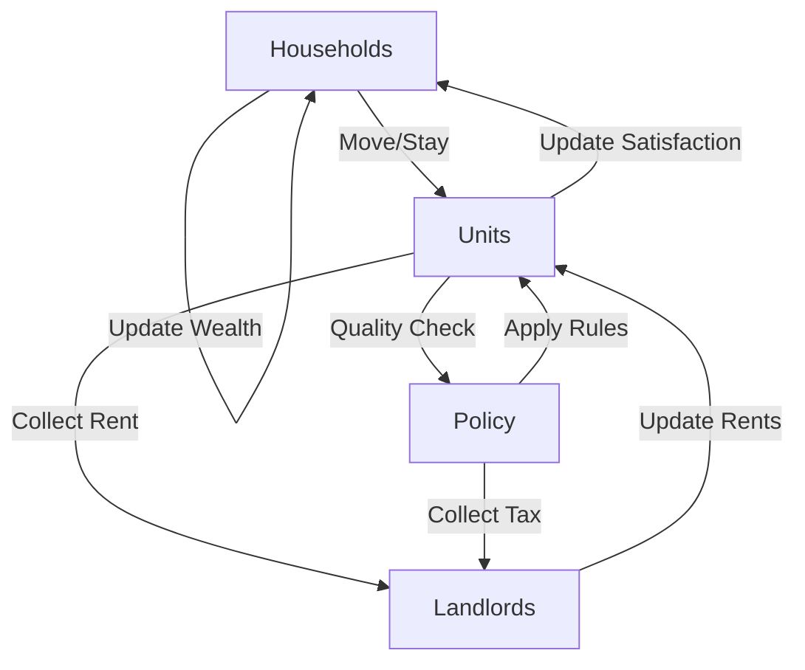

# How the Housing Market Simulation Works

## Simulation Loop

## Key Equations

### Household Decisions
- **Rent Burden** = Monthly Rent / Monthly Income
  - Above 40%: High risk of moving
  - Above 50%: Risk of eviction
- **Wealth Trend** = (Current Wealth - Initial Wealth) / Initial Wealth
  - Negative trend increases probability of seeking cheaper housing
- **Satisfaction** = Quality Score × (1 - Rent Burden Penalty)
  - Below 0.5: Likely to consider moving

### Landlord Behavior
- **Base Rent** = Market Rate × Quality Factor × Location Multiplier
- **Profit** = Total Rent - (Maintenance + Tax)
- **Quality Decay** = -0.1 per year without renovation

### Land Value Tax (LVT)
- **Land Value** = Base Land Value × Location Multiplier
- **Tax Amount** = Land Value × LVT Rate
- Only taxes undeveloped land value, not improvements
- Encourages development and efficient land use

### Rent Cap Policy
- **Maximum Increase** = 10% per year
- **Inspection Rate** = 5% of units per period
- Forces improvements when quality < 0.4

## Glossary

- **Migration Rate**: Probability of new households entering/leaving the market each period. Higher rates create more population turnover and dynamic housing demand.
- **Initial Households**: Starting number of renters in the simulation
- **Satisfaction**: Combined measure of housing quality and affordability
- **Quality**: Physical condition and amenities of a unit (0-1 scale)
- **Market Conditions**: External factors affecting prices and demand
- **Land Value**: Worth of the location, independent of buildings
- **Improvement Value**: Worth of buildings and renovations
- **Rent Burden**: Portion of income spent on rent
- **Wealth**: Household's total savings and assets
- **Renovation**: Improvement to unit quality (resets decay)
- **Eviction**: Forced move due to high rent burden or violations
- **Vacancy**: Unit without tenants
- **Policy Metrics**: Measurements of policy effectiveness 